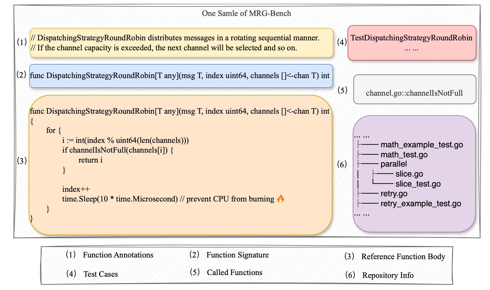

# MRGBench
This is the Official Repository for the repository level code generation benchmark: MRGBench

## Structure
```
.
├── data
│   ├── all_context_project_dict.json  # context information in project
│   ├── context_info.json # context information in file, 
│   ├── go_data_final.xlsx # data for Go
│   ├── java_data_final.xlsx # data for Java
│   └── py_data_final.xlsx # data for Python
├── repo # repository data
│   ├── go_data.7z
│   ├── java_data.7z
│   └── py_data.7z
├── result 
│   ├── cache_result # result of each model with different context in our experiment
│   │   ├── callee
│   │   ├── infile
│   │   ├── llms
│   │   ├── long_context
│   │   └── rag
│   ├── llms 
│   └── rag
└── src
    ├── eval  # code for evaluation and test 
    │   ├── AIClient.py
    │   ├── config.json
    │   ├── eval_llm.py
    │   ├── eval_rag.py
    │   ├── naive_rag.py
    │   ├── parse_run_log.py
    │   ├── repocoder.py
    │   └── run_test.py
    ├── parser  # code for parse repository into dataset
    │   ├── base_parser.py
    │   ├── csharp_parser.py
    │   ├── go_parser.py
    │   ├── java_parser.py
    │   └── py_parser.py
```
## Usage

MRGBench is a dataset designed for evaluating repository-level code generation tasks for large language models, as well as related Retrieval-Augmented Generation (RAG) and Agent methods. MRGBench encompasses three programming languages: Python, Java, and Go, comprising a total of 518 entries. Each entry includes a natural language description, repository information, and corresponding function test cases. Additionally, we provide a runnable Docker container, enabling researchers to quickly validate related algorithms using MRGBench.



The use of MRGBench can be divided into two steps:

1. Generate the corresponding function body for each use case using methods such as LLM, RAG, or Agent.
2. Verify the correctness of the generated function body in the Docker runtime environment and compute Pass@k.

### Generate corresponding code

In the experimental phase, we evaluated the performance of various large language models in different contexts and basic RAG methods. These evaluation scripts can be quickly executed to reproduce our results. 

#### Prepare Python Env
`pip install -r requirements.txt`

#### API key and url

We implemented the OpenAI API interface within `AIClient.py`. Users can configure their own URL and API key (e.g., for a locally deployed VLLM) in `config.json` to access the large language model.

#### Reproducing Results
For instance, to generate results for Go language samples using the DeepSeek model with infile context, you can run the following command:
```bash
python eval_llm.py -context_type <context_type> -lang_list <language_list> -model_name <model_name>
```
or 
```bash
python eval_llm.py --context_type in_file -lang_list go -model_name deepseek
```
Alternatively, to build a RAG system using the DeepSeek model and BM25 search, and generate results, you can run the following command:

```bash
python eval_rag.py -rag_type <rag_type> -lang_list <language_list> -model_name <model_name>
```
Here is an example command to run the evaluation script:
```bash
python eval_rag.py -rag_type bm25 -lang_list py,java -model_name deepseek
```

You can also design a new algorithm yourself, as long as the final output is in JSON format and contains the following fields:
```json
{
    "task-id": "?" // must the same as the task-id in data/*_final__data.xlsx
    "response": ["code-1", "code-2"] // list of code generated by LLM
}
```

### Verifying Correctness
To verify the correctness of the generated code, we provide a Docker container that can be used to run the code in a controlled environment.

1. Pull the Docker image (note that the data volume is large, so this may take some time).
```bash
docker pull mrgbench/mrgbench:v1
```
2. Use the following command to run the Docker image:
```bash
docker run -it mrgbench/mrgbench:v1 /bin/bash -v ../MRG-Bench:/root/MRG-Bench
```
3. After the container is created, run the following script to initiate the test:
```bash
cd /root/MRG-Bench
python run_test.py -df_path <data_path> -result_path <result_path> -lan <language>
```
For example:
```bash
python run_test.py -df_path data/py_data_final.xlsx -result_path result/llms/your_result.json -lan py
```
4. The test results will be saved in `result/llms/your_result.json_testresult.json`.


